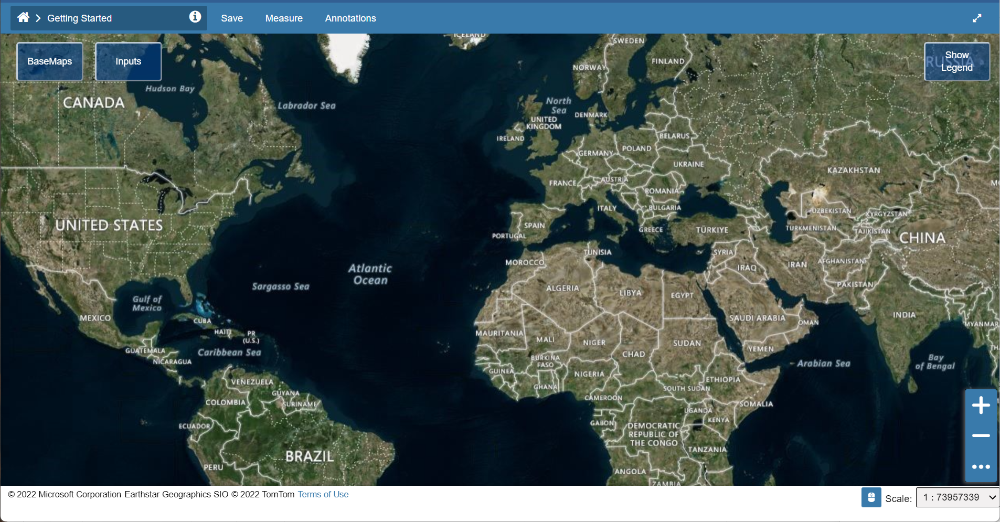

# Create a New Project

1. Log in to [hydrata.com](https://hydrata.com)
2. From the homepage, click **New Project**
3. Enter a project name and click **Create**

Project creation takes just a few seconds. Once created, you'll see the map viewer with base map layers.

!!! tip
    Use the layer panel on the left to explore the available base maps. You can adjust transparency using the slider next to each layer.
