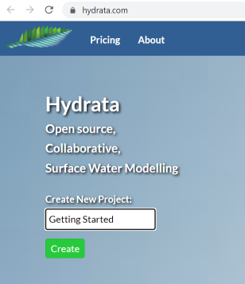
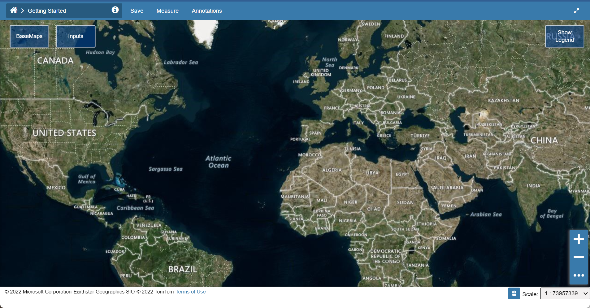

# Create a new project
Visit <https://hydrata.com> to sign up or sign in.

Once you are logged in, from the homepage create a new project by naming it and clicking "Create".

It will take a few seconds to create and load your project. Once it's created it will look like this:

Explore the base maps and transparency sliders if you wish.
