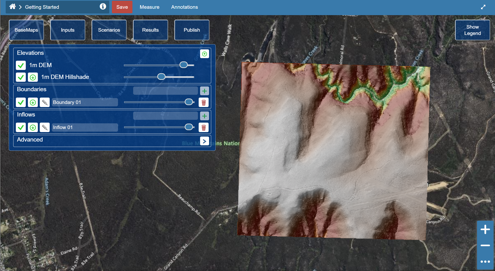
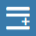

# Define model boundaries

First, let's give our layers a more recognisable name.

Click on the text box for "Boundary 01" and give it your own name. In our example we use "Full Catchment".

Now we can define the model boundary. We will run a rainfall-on-mesh simulation, so we should include the entire catchment within our boundary. You can use the Hillshade and DEM layer to help determine where that is (but don't worry too much, we will review our boundaries after the first trial run).

1. Click the pencil icon next to the Boundary layer  and wait for the boundary data to load.
2. In the boundary editor, click "Add New Feature" .
3. To draw the geometry, click "Draw Feature" .
4. We can now draw the model boundary polygon in the map interface. The boundary is defined as a single line. There is no need to close the polygon. Double click to finish drawing.
5. When you are happy with the geometry, click "Save Changes" .
