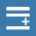

# Define rainfall

We define the rainfall in a similar process to the boundary definition. To get started, we will simulate 100mm/hr of constant, uniformly distributed rainfall. 

We can define the rainfall area as large as we like, as long as it covers our entire computational domain, as specified by the boundary in the previous step. 

As before, let's give our layers a more recognisable name.

Click on the text box for "Inflow 01" and give it your own name. In our example we use "50mm/hr Rainfall".

1. Click the pencil icon next to the Inflow layer  and wait for the inflow data to load.
2. In the rainfall editor, click "Add New Feature" .
3. To draw the geometry, click "Draw Feature" .
4. We can now draw the model rainfall area in the map interface. Just like the boundary, the rainfall is defined as a single line. There is no need to close the polygon. Double click to finish drawing.
5. When you are happy with the geometry, click "Save Changes" .

We are now ready to create a Scenario and run it.