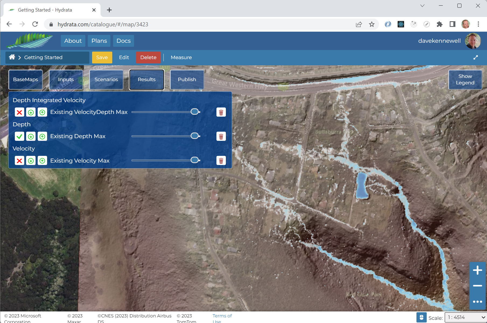
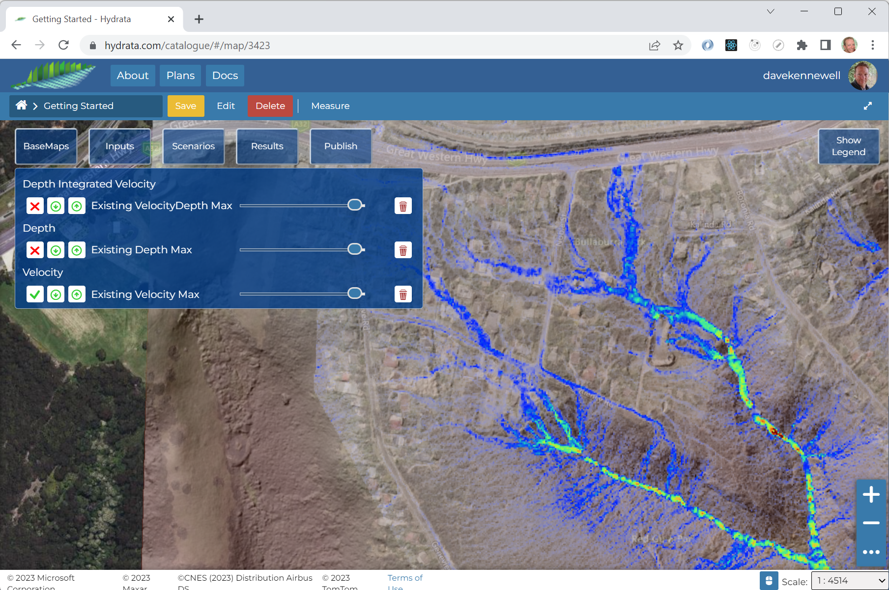
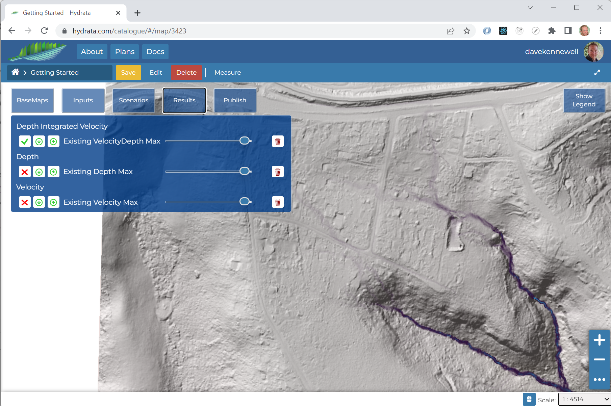

# Review Results

As the model run finishes, the results will be loaded onto the map automatically. 

Click the `Results` tab . You should see three result datasets:

 will toggle the layer visibility.

 will download the layer.

 will adjust the layer transparency.

 will remove the layer from the map (a copy will still be stored on the server).

Three result maps are produced. 

## Depth Maximum
The maximum depth map clearly highlights the potential for ponding on the highway to the north, and the detention basin accepts a significant volume of water within its embankment.

## Velocity Maximum
The velocity mapping highlights where and how water moves through the catchment. Two small waterfalls can be identified in the south-east of the northern tributary.

## VelocityDepth Maximum
The integral of velocity and depth serves as a proxy for "flow". It shows the areas where scour is more likely.

