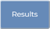
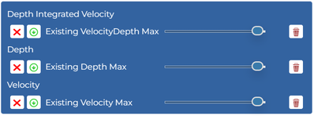
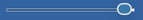

# Review Results

As the model run finishes, the results will be loaded onto the map automatically. 

Click the `Results` tab . You should see three result datasets:

 will toggle the layer visibility.

 will download the layer.

 will adjust the layer transparency.

 will remove the layer from the map (a copy will still be stored on the server).
