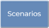

# Run a Scenario

Once built, running a model is quite simple. 

1. Click the `Scenarios` tab  
2. Click the `Run`  button for the scenario you wish to run. If the button is not available you may have to `build` the model first.
3. You will see the `Run Scenario` dialog box. 

```{note}
In the future, your account will have an purchased allocation of available run-time hours. For now, as we develop the product and recieve feedback from our users, this allocation is without limit. We currently host three concurrent servers for running models on a "first-come-first-served" basis.
```


The scenario log will appear. This log shows the output as processed by the `run_anuga` library. You can view and contribute to the code here: https://github.com/Hydrata/run_anuga

The model run duration will vary depending on your mesh resolution and modelled duration time. The model used in this example took about 25 minutes to run and had ~1,500,000 triangles in the mesh.