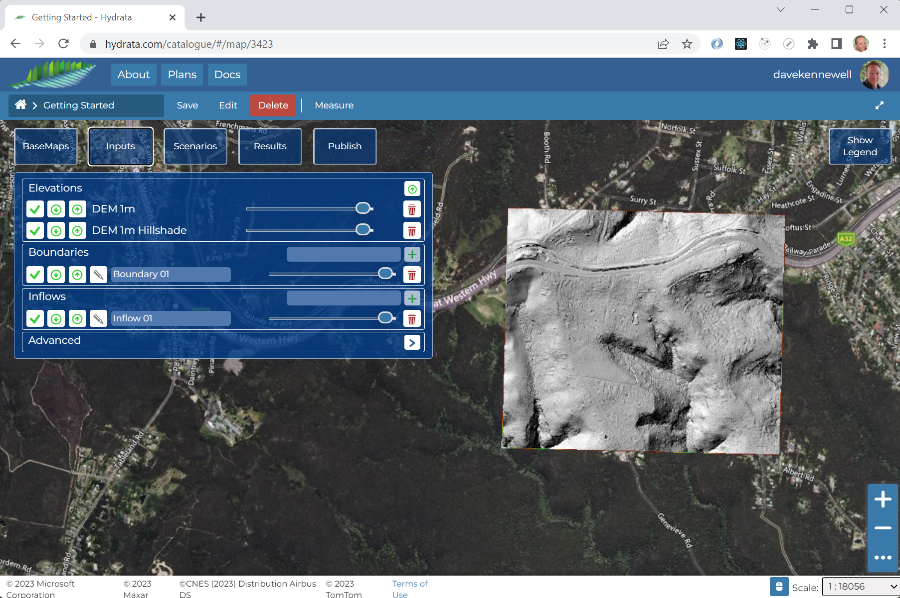

# Upload Elevation Data

You can upload your elevation data by:
1. Click the "Inputs" menu
2. Click the "Upload" icon 
3. Drag and drop, or click and select your elevation *.tif file from your local computer storage.
4. Give the Elevation a title - it usually makes sense to include the resolution of the raster here.
5. Click "Begin"

```{note}
Hydrata will recognise the location and projection of your geotiff. The file will be reprojected internally
into the appropriate Universal Transverse Mercator (UTM) zone. This zone will also be used for all other 
created layers and data in your project. 
```


The elevation data will be uploaded and imported. Note this process may take 3 to 5 minutes in total. Don't
worry if you close the browser or do something else - the processing will continue in the background. Once it
is complete, a number of things will have happened in your project:

1. Your elevation have a graduated colour scheme to show high and low regions.
2. Your elevation will have a hillshade layer to show surface features.
3. You will have default layers created for the model "Inflows" and "Boundaries".

At this stage it makes sense to save your project.

```{note}
Hydrata will always save the *data* in your layers, at the moment the data is created. However, selecting when to save the 
overall layout of the project map is the choice of the user. 
```

If all is well, your project should look similar to this:



